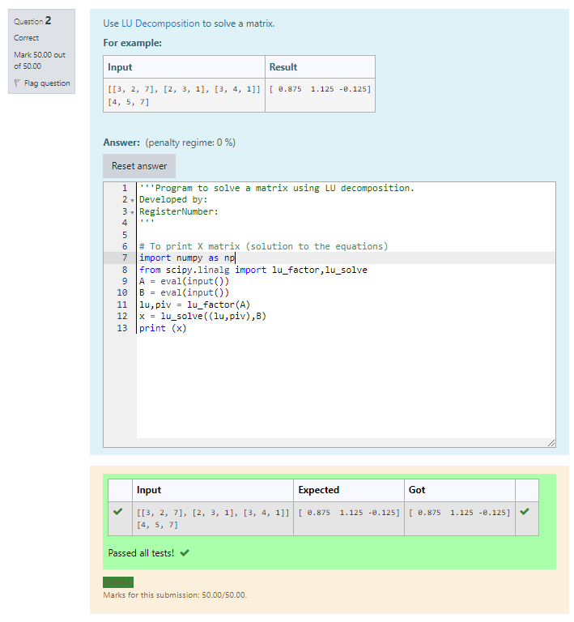

# LU Decomposition without zero on the diagonal
## AIM:
To write a program to find the LU Decomposition of a matrix.
## Equipments Required:
1. Hardware – PCs
2. Anaconda – Python 3.7 Installation / Moodle-Code Runner
## Algorithm
1. import numpy 
2. use scipy
3. print the output 
## Program to find L and U matrix using LU decomposition :
~~~
'''Program to find L and U matrix using LU decomposition.
Developed by   : Venkatesh E 
RegisterNumber : 21003352
'''
import numpy as np
from scipy.linalg import lu
a=eval(input())
P,L,U=lu(a)
print(L)
print(U)
~~~
## Output:

## Program to solve a matrix using LU decomposition:
~~~
import numpy as np
from scipy.linalg import lu_factor,lu_solve
A = eval(input())
B = eval(input())
lu,piv = lu_factor(A)
x = lu_solve((lu,piv),B)
print (x)
~~~
## Output:

## Result:
Thus the program to find the LU Decomposition of a matrix is written and verified using python programming.

